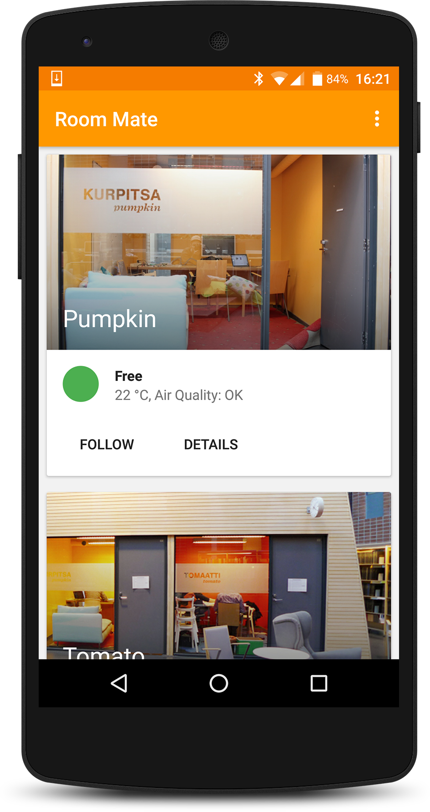
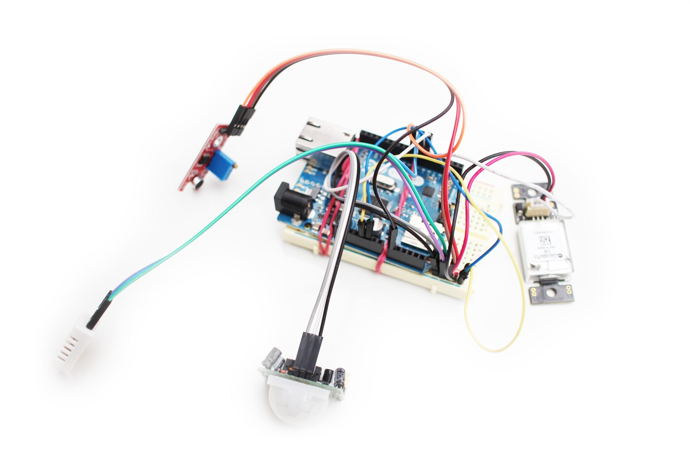
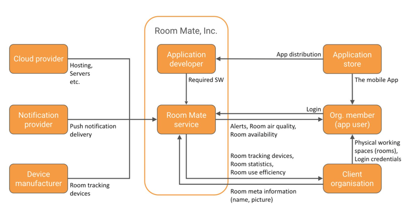

**_Room Mate_**

**_– A Group Work Space Monitor Tool _**

Elisa IoT Challenge submission

June 17th, 2016

		

1. Introduction 						

Finding a free meeting room can be an unnecessary hassle for employees across organizations. The most common modern solution is an online room reservation system, but the effort of reserving a room often feels over the top, especially if the need is ad hoc, or just for half an hour or so. Additionally, rooms are sometimes reserved "just in case" for a longer period of time than necessary, which leads to lots of wasted time when nobody is using the room although it is empty. What’s important, is *whether the room is actually currently empty or not*, and the state-of-the-art way to know that is to go and see. This is something we want to make easier.

						

Room Mate is a group workspace monitoring tool, which uses **a device with sensors** to monitor primarily the occupation of a room (group work space, meeting room or similar) and secondarily the air quality in the room. That information is then delivered to people currently using or willing to use the room through **a mobile app**. In short, Room Mate acts as an additional pair of eyes (and a nose) that always keep watch on the room. Moreover it also lets people in the room know (for example via push notification) when it’s time to take a break and open the door to get some fresh air and stay effective through the whole working session.

						

**A short video clip pitching the service concept is currently available at:**

[https://www.dropbox.com/s/rwkobirkmy7guw4/room-mate-pitch-video-final.mp4](https://www.dropbox.com/s/rwkobirkmy7guw4/room-mate-pitch-video-final.mp4)

						

**Another video clip showing the prototype app itself is available at:**

[https://www.dropbox.com/s/r6wy9p7wong8set/room_mate_app.mp4](https://www.dropbox.com/s/r6wy9p7wong8set/room_mate_app.mp4)

2. Preliminary business model 

This chapter presents the preliminary business model of the system based on the STOF framework. The most critical issues are identified and discussed in more detail. In the end the deployment plan for the service is laid out based on the business model.

						

*2.1 S for Service domain*

						

Room Mate’s value proposition to the customer is twofold. For the end users, as described in the introduction, the system takes away the stress of quickly finding a good place to work in an ad hoc manner, and enhances productivity by notifying the users about suboptimal air quality. For the client organisation, the optimized use of office space and meeting rooms, as well as the well-being of employees or other users of the spaces (e.g. students) manifests itself in saved resources and better information about the usage and condition of the physical premises of the organization. The additional, room-specific connected device provides also huge possibilities to create inspiring, helpful, meaningful, and fun interactions between people in and outside the room. Ask someone to pop in? Let others know we’re leaving the room soon?

						

Our target group includes organizations with physical spaces for small group work or meetings. That covers virtually any modern knowledge work oriented organization with a headcount bigger than 10: corporations, agencies, schools, NGOs, public sector departments and so on. In all those organizations there are people who sit in front of their computers or notebooks, holding meetings and group activity sessions in small rooms. Room Mate provides them all with a low-effort tool to better manage that kind of work. The happiness and health of the people means happiness and health of the organization. The spaces are used up to their full potential and unlike a conventional room reservation system, Room Mate provides a more flexible, real-time solution which makes the space serve the purpose here and now.

*2.2 O for Organization domain*

A host of actors is required to create the value of the system. Room Mate’s key actors include the device manufacturer, client organization’s office/campus management, cloud provider, app developer, service provider (us), app marketplaces, telco & internet operators, and finally the users of the rooms and Room Mate mobile app.

The organization design is presented as a value network in the following diagram:

		

*Figure 2.1: Organization design of Room Mate*

The different stakeholders (organizations) can be divided into three parts: downstream partners that use our service and upstream organizations that we use to deliver our service. On the upstream side (left side of figure 2.1), we plan to outsource services for hosting (cloud) and notification delivery (this is where Elisa & ThingWorx could be usedul), as well as the assembly line of the physical devices. Downstream parts (right side of figure 2.1) are the stakeholders that use our service: organizations and their members. These stakeholders work with our service to increase the efficiency of their operations. We also need their input to enter the metadata of the rooms to the service. In addition, the application store works in both roles: We use them for app delivery, and users use them for getting the application to their phones easily.

*2.3 F for Finance domain*

The revenue model of Room Mate is based on monthly subscription fees that client organizations pay based on the amount of their rooms covered by Room Mate system. Our primary clients are large organizations with lots of meeting rooms, for example knowledge work companies or universities. Given the soaring real estate prices in large cities, we assume a strong demand for a service that helps organizations use their current square meters more efficiently.

Just in Finland there are about 600 large enterprises with employee headcount more than 250 each, and together these companies employ about half a million people (NOTE:  https://www.yrittajat.fi/sites/default/files/migrated_documents/sy_yrittajyystilastot_2015_eng.pdf). If we assume half of them are white collar workers (NOTE:  https://fi.wikipedia.org/wiki/Toimihenkilö states that on 2007 about ⅓ of Finnish workforce were white collar, but we play it down to play it safe and to take into account that over 90 % of Finnish companies have max 10 employees, where the proportion of white collars is assumed relatively higher than in large corporations.), we have 250,000 people who work in a large organisation and supposedly need meeting rooms every now and then. Globally the opportunities are even more massive, for example the IT consulting giant Accenture alone has 373,000 employees (NOTE:  https://newsroom.accenture.com/fact-sheet/)!

The use of sensors in this kind of IoT service means an additional cost from manufacturing and distributing physical devices, which makes this project different from more traditional software businesses, such as mere mobile applications or computer programs. The project requires significant investments up-front. However, from a client’s point of view, a high starting fee discourages buy-in and should thus be avoided. Therefore it’s important to streamline the assembly and distribution process of the physical devices to make them as cost effective as possible. That is done by outsourcing the assembly work to a reliable partner in far east, ordering the devices in reasonably large quantities, shipping them to the clients, and finally let them do the installation of the devices themselves. In this way less capital is needed in the beginning and the liquidity problems can be managed.

Additionally Room Mate provides an extensive installation service for clients that don’t want to set the system up by themselves. In this service the margin must be high in order to avoid overbooking and to encourage the self service installation option.

Once the client is satisfied to Room Mate’s solution, the monthly subscription fees ensure a steady and predictable, if not very huge, revenue flow. Moreover, the ongoing client relationship opens up possibilities to extend Room Mate’s services and cover more of the client company’s premises. The physical device itself serves as a marketing tool since a guest user of a space can notice the device and ask about it, thus spreading the word to other organizations.

On the cost side, cloud server and notification providers charge monthly subscription fees (based on used resources), which further justifies using the same kind of model in downstream side as well.

*2.4 T for Technology domain*

Technology-wise the system consists of three components: the physical devices with embedded software, the mobile app, and the cloud.

The cost effective distribution of the physical devices as explained in previous chapter is required to ensure financial feasibility. Secondly, the devices must be designed to be as simple to set up as possible.

*2.5 Deployment plan*

The deployment of Room Mate requires the following steps: Firstly, the project has now reached a level where proper user testing and concept validation is needed in order to avoid wasting development resources. That can be carried out in Elisa’s premises by assembling and installing a set of tracking devices and distributing the app download link among employees. User interviews and contextual inquiries would give us meaningful information about the potential users and direct the further development of the service, including prioritizing features and defining the scope. In the meantime we should calculate the business case to properly evaluate financial feasibility.

Second step is to design the form factor and casing for the tracking device – again with heavy user involvement and prototyping emphasis. Third phase would be to assemble and produce a proper, all-inclusive prototype batch of tracking devices, including casing, installation instructions and full functionality. Then the service could be piloted internally. At the same time there should be negotiations going on with potential manufacturers, as well as prospect clients and funding institutions.

When everything looks ready for production, the deals for manufacturing and hosting should be closed. The system needs to be transferred to a more powerful platform (read: ThingWorx) and also hiring new salespeople should be considered. 

By working in an iterative manner as outlined above, we would be able to adjust our efforts quickly if required. Partnering with Elisa and leveraging ThingWorx platform would of course have an effect to these initial plans.

3. Team Profile

We are team Room Mate. We are Master’s students from Aalto School of Science and School of Engineering in Aalto University. Our skills include Android development, embedded system programming, backend development and UI/UX design. We are participating the Elisa IoT challenge as a group of individuals.

Contact person: Anssi Grekula, [anssi.grekula@aalto.fi](mailto:anssi.grekula@aalto.fi), 

Team:

<table>
  <tr>
    <td>Name</td>
    <td>Email</td>
    <td>Tel</td>
    <td>Identification Number</td>
  </tr>
  <tr>
    <td>Jin Jin</td>
    <td>jin.jin@aalto.fi</td>
    <td></td>
  </tr>
  <tr>
    <td>Juho Marttila</td>
    <td>juho.marttila@aalto.fi</td>
    <td></td>
  </tr>
  <tr>
    <td>Joni Lampio</td>
    <td>joni.lampio@aalto.fi</td>
    <td></td>
  </tr>
  <tr>
    <td>Anssi Grekula</td>
    <td>anssi.grekula@aalto.fi</td>
    <td></td>
  </tr>
  <tr>
    <td>Julius Eerola</td>
    <td>julius.eerola@aalto.fi</td>
    <td></td>
  </tr>
</table>

Our team has no previous experience about ThingWorx, so we would need hands-on training starting from the basics to get going with the platform.

